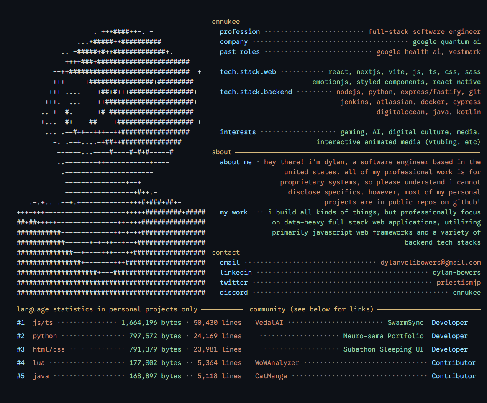

<!-- if you want to know how this works, feel free to check out the scripts/ directory and the React + Vite app located under /display/display -->

Community Project Details

|Started|Status| Group | Project | Role | Link | Backup |
|------|---|----------|----------|----------|----------|----------|
|12/11/2025|Active| [VedalAI](https://vedal.ai/) | Subathon 2025 Sleeping UI | Sole Developer | [Stream VoD](https://www.twitch.tv/videos/2651266421?t=14h44m55s) | [Image](https://github.com/ennukee/ennukee/tree/main/assets/sleeping_ui.png) |
|12/9/2025|Active| [VedalAI](https://vedal.ai/) | Neuro-sama Portfolio | Sole Developer | [Link](https://portfolio.neurosama.com/) | [Image](https://github.com/ennukee/ennukee/tree/main/assets/neurosama_portfolio.png) |
|3/5/2025|Maintaining| [VedalAI](https://vedal.ai/) | SwarmSync | Lead Developer | [iOS](https://play.google.com/store/apps/details?id=com.vedal.ai.swarmsync)/[Android](https://apps.apple.com/us/app/swarm-sync/id6749556809)|N/A|
|9/1/2021|Project Retired| [BCS](https://twitter.com/BCScanlations) | [CatManga](https://www.reddit.com/r/KanojoOkarishimasu/comments/qs8d8k/catmanga_has_announced_its_shutdown_today_it_is/) | Contributor |N/A|N/A|
|7/1/2017|Left Project| WoWAnalyzer | WoWAnalyzer | Contributor | [Link](https://wowanalyzer.com/) |N/A|

